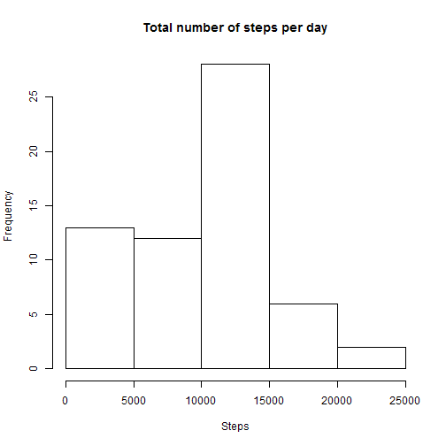
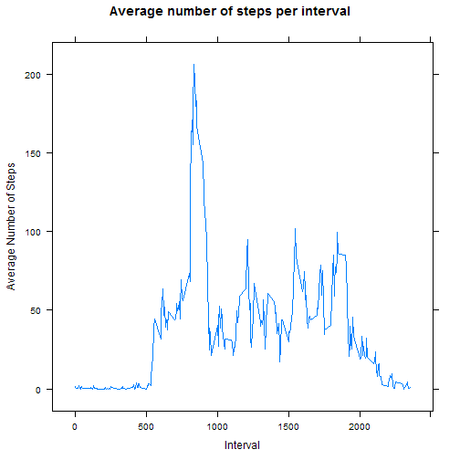
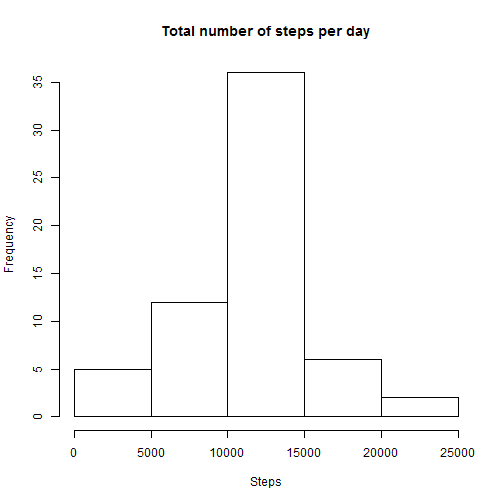
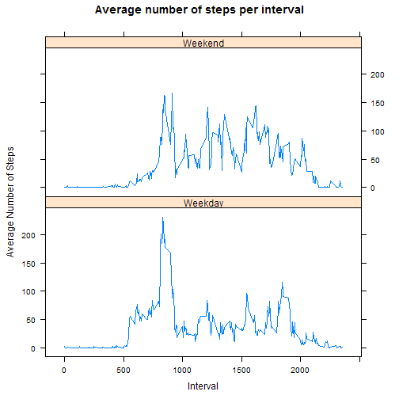

# Reproducible Research: Peer Assessment 1
## Loading and preprocessing the data
Unzip the provided data file

```r
unzip("activity.zip")
```
Load the data

```r
data <- read.csv("activity.csv")
```
Convert the **date** feature from *factor* into a *Date*

```r
data <- transform(data,date=as.Date(date))
```
## What is mean total number of steps taken per day?
Calculate the total number of steps per day

```r
steps_per_day <- aggregate(list(steps=data$steps),
                           by=list(date=data$date),
                           FUN=sum,na.rm=TRUE)
```
Plot the histogram  
*Note: Since there are no specific questions we are trying to answer with this histogram, the default parameters (e.g. number of bins) are used*

```r
hist(steps_per_day$steps,main="Total number of steps per day",xlab="Steps")
```

 


Calculate the mean number of steps per day  
*Note: While not specified by the assignment, removing NAs makes sense*

```r
mean(steps_per_day$steps,na.rm=TRUE)
```

```
## [1] 9354
```
Calculate the median number of steps per day  
*Note: While not specified by the assignment, removing NAs makes sense*

```r
median(steps_per_day$steps,na.rm=TRUE)
```

```
## [1] 10395
```
## What is the average daily activity pattern?
Calculate the average number of steps for each interval accross all days

```r
avg_steps_interval <- aggregate(list(avg_steps=data$steps),
                                by=list(interval=data$interval),
                                FUN=mean,na.rm=TRUE)
```
Make a time series plot (i.e. type = "l") of the 5-minute interval (x-axis) and the average number of steps taken, averaged across all days (y-axis)

```r
library(lattice)
xyplot(avg_steps~interval,data=avg_steps_interval,
       type="l",
       main="Average number of steps per interval",
       xlab="Interval",ylab="Average Number of Steps")
```

 


Find the interval with the maximum number of steps

```r
avg_steps_interval$interval[which.max(avg_steps_interval$avg_steps)]
```

```
## [1] 835
```
## Imputing missing values
Calculate and report the total number of missing values in the dataset (i.e. the total number of rows with NAs)

```r
sum(is.na(data)) #This works because in R: TRUE==1
```

```
## [1] 2304
```
My strategy for imputing the missing values is to replace the NAs with the mean for the corresponding 5-minute interval (since we've already calculated that previously). While this might not be as good as a more flexible solution (e.g. K nearest neighbours), but it should be good enough for this exercise and will preserve some of the daily patterns (though will smooth it across the days)  
  
Fill in the missing values

```r
#Create the new data frame by associating an average number of steps
#for the corresponding interval with each row
data_no_NA <- merge(data,avg_steps_interval,by.x="interval",by.y="interval")
#Replace the NAs in the steps column with that average
data_no_NA$steps[which(is.na(data_no_NA$steps))] <- data_no_NA$avg_steps[which(is.na(data_no_NA$steps))]
#Remove the average steps column from the data frame 
#to match the original structure
data_no_NA <- data_no_NA[,1:3]
```
Calculate the total number of steps per day

```r
steps_per_day <- aggregate(list(steps=data_no_NA$steps),
                           by=list(date=data_no_NA$date),
                           FUN=sum,na.rm=TRUE)
```
Plot the histogram  
*Note: Use the same default parameters (e.g. number of bins) as in the first histogram*

```r
hist(steps_per_day$steps,main="Total number of steps per day",xlab="Steps")
```

 


Calculate the mean number of steps per day

```r
mean(steps_per_day$steps)
```

```
## [1] 10766
```
Calculate the median number of steps per day

```r
median(steps_per_day$steps)
```

```
## [1] 10766
```
## Are there differences in activity patterns between weekdays and weekends?
Create a new factor variable in the dataset (*we*) with two levels - "Weekday" and "Weekend" indicating whether a given date is a weekday or weekend day.

```r
data_no_NA$we <- as.factor(ifelse(
                        weekdays(data_nona$date) %in% c("Saturday","Sunday"),
                        "Weekend", "Weekday")) 
```
Calculate the average number of steps for each interval accross all days

```r
avg_steps_interval <- aggregate(list(avg_steps=data_no_NA$steps),
                                by=list(interval=data_no_NA$interval,we=data_no_NA$we),
                                FUN=mean,na.rm=TRUE)
```
Make a panel plot containing a time series plot (i.e. type = "l") of the 5-minute interval (x-axis) and the average number of steps taken, averaged across all weekday days or weekend days (y-axis). The plot should look something like the following, which was creating using simulated data:

```r
library(lattice)
xyplot(avg_steps~interval|we,data=avg_steps_interval,
       type="l",main="Average number of steps per interval",
       layout = c(1, 2),
       xlab="Interval",
       ylab="Average Number of Steps")
```

 

